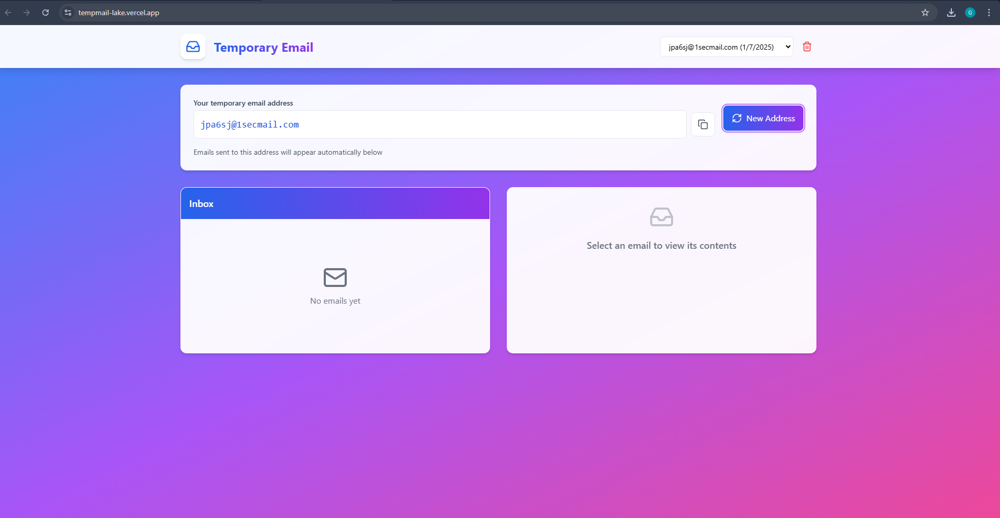

# Temporary Email Service

A modern, user-friendly temporary email service built with React, TypeScript, and Tailwind CSS. Create disposable email addresses instantly and manage multiple accounts with ease.



## Features

- 🚀 Instant temporary email creation
- 💾 Save up to 5 recent email accounts locally
- 📨 Real-time email reception
- 📱 Responsive design with modern UI
- 🎨 Beautiful gradient and glass-morphism effects
- 🔄 Easy account switching
- 📋 One-click email address copying
- 🗑️ Account management with deletion support

## Tech Stack

- **Frontend Framework**: React 18 with TypeScript
- **Styling**: Tailwind CSS with custom utilities
- **Build Tool**: Vite
- **Icons**: Lucide React
- **State Management**: React Hooks
- **Storage**: Local Storage for persistence
- **API Integration**: REST API with automatic token refresh

## Getting Started

### Prerequisites

- Node.js (v14 or higher)
- npm or yarn

### Installation

1. Clone the repository:
```bash
git clone https://github.com/gauravitis/tempmail.git
cd tempmail
```

2. Install dependencies:
```bash
npm install
```

3. Start the development server:
```bash
npm run dev
```

4. Open your browser and visit `http://localhost:5173`

### Building for Production

```bash
npm run build
```

The built files will be in the `dist` directory.

## Usage

1. **Creating an Email Address**:
   - The service automatically creates a temporary email address when you first visit
   - Click the "New Address" button to generate a new one

2. **Managing Accounts**:
   - Up to 5 recent accounts are saved automatically
   - Use the dropdown in the header to switch between accounts
   - Click the trash icon to delete unwanted accounts

3. **Receiving Emails**:
   - Emails are automatically fetched every 5 seconds
   - Click on an email in the inbox to view its contents
   - All emails are saved locally and persist across page refreshes

## Development

### Project Structure

```
src/
├── components/     # React components
├── services/      # API and service functions
├── types/         # TypeScript type definitions
├── App.tsx        # Main application component
└── main.tsx       # Application entry point
```

### Key Components

- `App.tsx`: Main application logic and layout
- `EmailBox.tsx`: Email address display and management
- `EmailList.tsx`: Inbox message list
- `EmailViewer.tsx`: Email content display

## Contributing

1. Fork the repository
2. Create your feature branch (`git checkout -b feature/AmazingFeature`)
3. Commit your changes (`git commit -m 'Add some AmazingFeature'`)
4. Push to the branch (`git push origin feature/AmazingFeature`)
5. Open a Pull Request

## License

This project is licensed under the MIT License - see the [LICENSE](LICENSE) file for details.

## Acknowledgments

- Thanks to all contributors who have helped shape this project
- Special thanks to the React and Tailwind CSS communities for their excellent documentation 